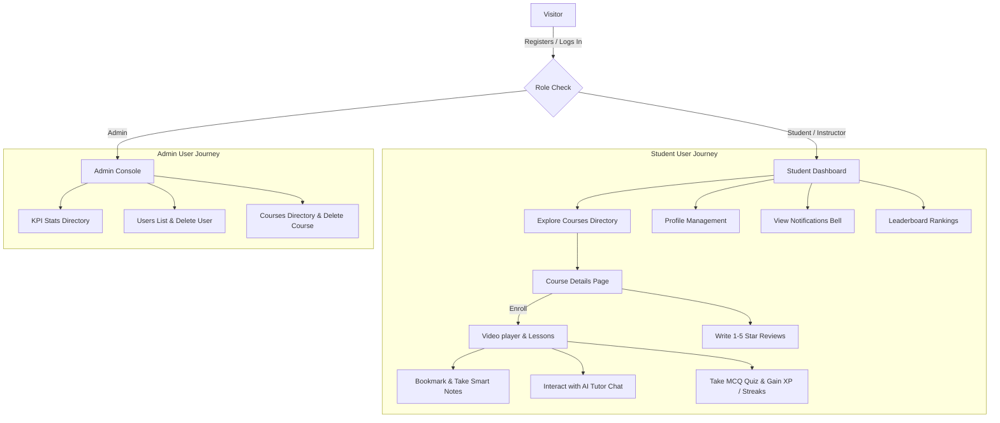

# LearnSphere AI 🚀 (AI-Powered Learning Management System)

LearnSphere AI is a complete, production-ready, feature-rich Learning Management System (LMS). It includes student and administrator portals, integrating advanced mechanics like screen capture/screenshot protection, dynamic video bookmarking with iframe-based seek navigation, persistent smart notes, AI-powered quiz assessments, and streaked gamification.

---

## 💻 Tech Stack & Languages

### Languages Used:
- **Frontend**: JavaScript (ES6+), HTML5, CSS3 / Vanilla CSS + Tailwind CSS v4 styling
- **Backend**: JavaScript (Node.js/Express)
- **Database**: SQL (PostgreSQL, structured via Sequelize ORM mapping)

### Key Frameworks & Libraries:
- **Frontend Core**: React.js (Vite compiler)
- **State Management**: Zustand (for user session profiles)
- **Data Querying**: TanStack React Query (caching and remote state syncing)
- **UI Components & Icons**: Heroicons / React Icons
- **Animations**: Framer Motion
- **Database Management**: Sequelize ORM
- **Security & Utilities**: JSON Web Tokens (JWT), bcrypt.js (password hashing)
- **AI Engine**: Google Gemini Developer API (for tutor explanations & quiz generation)

---

## 🔄 End-to-End User Flow

The application divides workflows based on security roles:



### 1. Student Flow
- **Registration & Access Control**: Users register via `/register` (defaulting to a `Student` role) and log in.
- **Learn & Dashboard**: Land on `/dashboard` to see enrolled course progress, total XP, and active streaks.
- **Course Detail & Reviews**: Browse `/courses`, select a course, read student reviews, and enroll instantly.
- **Playback & Protections**: View lessons under `/course/:courseId`. Developer tools keys are disabled, and switching windows immediately blurs the screen.
- **Study Aids & AI Chat**:
  - Save specific coordinates (timestamps) to **Bookmarks** or **Smart Notes** to jump back later.
  - Ask the **AI Tutor** questions directly regarding the video context.
  - Test knowledge by completing a dynamic **3-Question MCQ Quiz** to earn **50 XP** per correct answer and boost active activity streaks.
- **Leaderboard**: Compete with other students on the global Leaderboard based on accumulated XP.

### 2. Admin Flow
- **Auto-Redirection**: Logging in as an Administrator (`admin@learnsphere.ai`) bypasses normal dashboards, routing directly to the Admin console (`/admin`).
- **Dashboard & User Management**: View total stats, list all registered accounts, and delete inactive users (guarded against self-deletion).
- **Course Catalog Management**: Browse the fully listed course inventory showing thumbnails, instructor profiles, levels, and trigger instant catalog deletion routes.

---

## 🗄 Database Schema Models

The system is configured in PostgreSQL under 8 distinct database tables:

1. **User**: `id`, `name`, `email`, `password`, `role`, `avatar`, `xp`, `streak`, `lastActive`.
2. **Course**: `id`, `title`, `description`, `category`, `thumbnail`, `difficulty`, `rating`, `price`.
3. **Video**: `id`, `courseId` (FK), `title`, `description`, `url`, `duration`, `order`.
4. **Enrollment**: `id`, `userId` (FK), `courseId` (FK), `progress` (0-100), `completedAt`.
5. **Review**: `id`, `userId` (FK), `courseId` (FK), `rating` (1-5), `comment`.
6. **Notification**: `id`, `userId` (FK), `type` (enrollment/xp_earned/review/system), `message`, `isRead`, `link`.
7. **Bookmark**: `id`, `userId` (FK), `videoId` (FK), `timestamp`, `title`.
8. **Note**: `id`, `userId` (FK), `videoId` (FK), `timestamp`, `content`.

---

## 📡 API Endpoints Catalog

### 🔑 Authentication & Profiles (`/api/auth`)
- `POST /api/auth/register` - Create student credentials and start session.
- `POST /api/auth/login` - Authenticate credentials and return JWT cookie.
- `POST /api/auth/logout` - Clear JWT authentication cookie.
- `GET /api/auth/profile` - Fetch current user's profile details.
- `PUT /api/auth/profile` - Update user's name, email, or avatar.
- `GET /api/auth/leaderboard` - Fetch top ranked students by XP.
- `GET /api/auth/admin/stats` - Fetch overall LMS platform analytics.
- `GET /api/auth/admin/users` - Fetch lists of users dynamically.
- `DELETE /api/auth/admin/users/:id` - Deletes a user (admin-level authorization required).

### 📚 Course Catalog (`/api/courses`)
- `GET /api/courses` - List all courses with detail structures.
- `GET /api/courses/:id` - Load specific course info, lessons, and review statistics.
- `POST /api/courses` - Create a course (Instructor only).
- `DELETE /api/courses/:id` - Delete a course (Admin only).

### 🎓 Enrollments & Progress (`/api/enrollments`)
- `POST /api/enrollments/:courseId` - Enroll in a course.
- `DELETE /api/enrollments/:courseId` - Unenroll from a course.
- `GET /api/enrollments` - Fetch enrolled course cards and actual completion progress.
- `PUT /api/enrollments/:courseId/progress` - Update progress percentage tracking.

### 🔔 Notifications (`/api/notifications`)
- `GET /api/notifications` - Fetch recent unread notifications.
- `PUT /api/notifications/:id/read` - Mark a single notification read.
- `PUT /api/notifications/read-all` - Clear notification badge indicators.

### 📝 Course Reviews (`/api/reviews`)
- `POST /api/reviews/:courseId` - Leave a star rating and comment on a course.
- `GET /api/reviews/:courseId` - Retrieve reviews for a course.

### 🤖 AI Tutor & Gamification (`/api/tutor`)
- `POST /api/tutor/chat` - Prompt Gemini using lesson transcript context.
- `POST /api/tutor/quiz` - Generate a custom 3-question MCQ quiz for a video.
- `POST /api/tutor/quiz/score` - Submit quiz results to earn XP and update streaks.

### 🔖 Bookmarks (`/api/bookmarks`)
- `GET /api/bookmarks?videoId=...` - Fetch saved lesson bookmarks.
- `POST /api/bookmarks` - Save bookmark timestamp.
- `PUT /api/bookmarks/:id` - Rename bookmark title.
- `DELETE /api/bookmarks/:id` - Remove bookmark coordinates.

### ✍️ Smart Notes (`/api/notes`)
- `GET /api/notes` - Retrieve saved personal student notes.
- `POST /api/notes` - Add a markdown note pinned at a timestamp.
- `DELETE /api/notes/:id` - Prune saved notes.

---

## 🚀 Running the Project

### 1. Database Seeding
Navigate to `/server` and seed the tables:
```bash
node seed.js
```

### 2. Run Backend Server
Inside `/server`:
```bash
npm run dev
```
*(Runs at `http://localhost:5000`)*

### 3. Run Frontend Server
Inside `/client`:
```bash
npm run dev
```
*(Runs at `http://localhost:3000`)*
